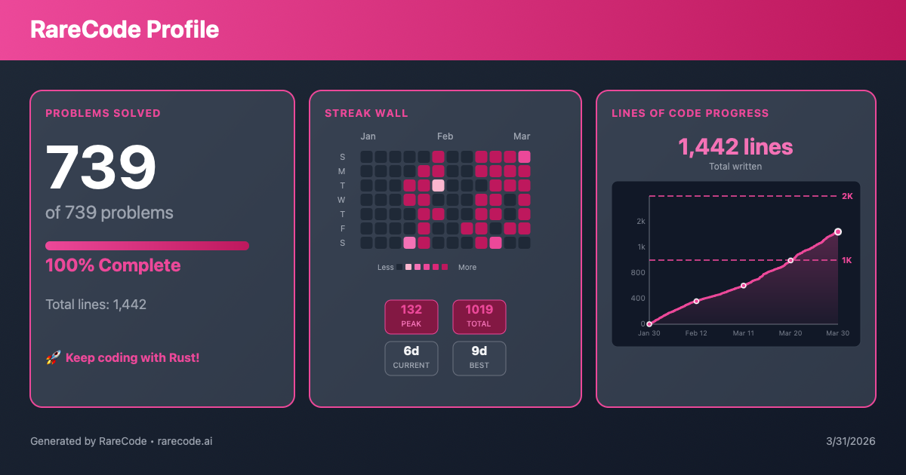
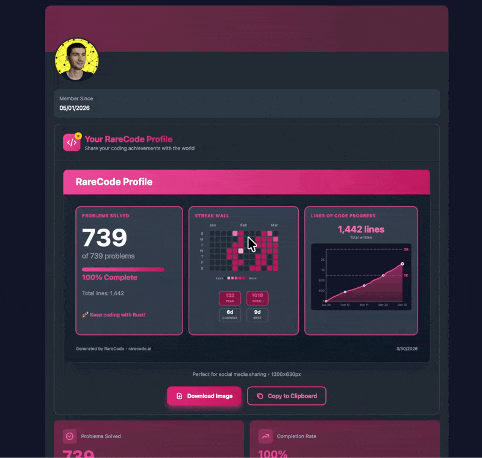

I took me around 8 months of procrastination, but at one point I finally finish 739 Rust exercices, as a non programmer.

Let me told you the story of a non programmer (yet) learning Rust as it's first language.

## Javascript, SaaS and illusions.

At the verry beggining, I was wandering what to do in my life, what I really want to do in my life I mean. I watch on YouTube a video about AI and SaaS… I won't going deep here, you picture the story. Juste some random beautiful thing that make money, but the reallity is différent.

But, while AI was just for me shiny object, SaaS in the other side was something that really interested me. So I started to learn JavaScript.
And… it was terrible for me.

I don't hate JS, or saying that it's a bad language, it's just a really bad fit for me.

Maybe I learn JS for 3 months, with A LOT of procratination. In 3 months I maybe really work 15 days entirelly.

By the time I procrastinated, I discovered Rust 🦀.

## Rust, my love 💛

I don't remember how I discovered Rust, but I remember that 5 minutes later, I was conquered.

I probably find a post or a video about it. And then, after understand the core ideas of Rust, I was in love with.

So from here I switch from JS to Rust… in my mind at least. Beacause my number one ennemy in my life as returned again: PROCRASTINATION, I took me a long time to actually start to code.

Understand that, 0% of my procrastination was cause by Rust itself, it was just me.

At this point I was:

1. a non programmer
2. who love Rust
3. and procrastinate almost everything in his life.

If you only have the firsts two points, you'll be fine with Rust.

### The valley of death = PROCRASTINATION

I procrastinate a lot at this moment, but I also was in love with Rust. So I dreamed about many thing that I could build with in the future. I create some roadmaps to learn and master Rust…

But sometime I did something:

- I start to work on the well known "The Book", which is a really great book… but not for my level. After a few chapters, to many questions in my head was unanwsered.
- To find some anwser I started another book: "Learn Rust in a Month of Lunches", which is great, but like before, to many question was still unanwsered.
- I ended up learning the hardware, the big picture of how computer works.

Since I discovered Rust maybe 5 months already pass. And I didn't code at all in Rust.

### The first time coding in Rust

The day I turned 24 I wanted to really change things, so I started RareCode.

